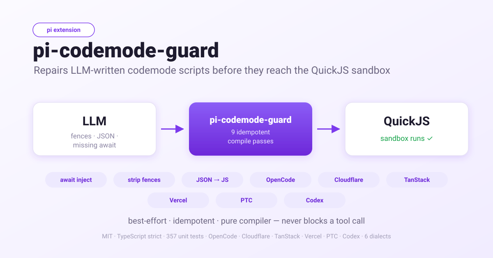

# pi-codemode-guard

English | [简体中文](./README.zh-CN.md)

<p align="center">
  
</p>

[](./LICENSE)
[](https://github.com/earendil-works/pi)
[](https://pi.dev/packages)
[](./tsconfig.json)
[](./package.json)
[](https://pnpm.io)

**pi-codemode-guard** is an open-source (MIT), TypeScript extension for the
[pi](https://github.com/earendil-works/pi) AI coding agent that **repairs
LLM-written `codemode` scripts before they reach the sandbox**. It inserts
missing `await`, strips markdown fences, converts JSON tool-call programs into
real JavaScript, normalizes `@options:` / `@exec:` pragmas, unwraps async IIFEs, and
translates the OpenCode, Cloudflare agents, TanStack AI, Vercel AI SDK,
DeepSeek Harness PTC, and OpenAI Codex code mode dialects — so AI-generated
agent scripts run instead of silently failing.

In one sentence: *a best-effort, idempotent compiler that turns broken
codemode tool calls from any LLM into the exact JavaScript pi's QuickJS sandbox
expects — without forking the codemode implementation.*

Many models cannot write pi's codemode tool call correctly. They wrap the script
in a markdown fence, send it as JSON tool calls, use the wrong field name, write
a relaxed `@options:` line, wrap everything in an async IIFE, or forget the
`await` — and an unawaited tool call is silently JSON-serialized as `{}`.

`pi-codemode-guard` fixes all of that before the script reaches the sandbox,
without forking the codemode implementation.

```
model                      pi-codemode-guard                    codemode sandbox
───────────────────────────────────────────────────────────────────────────────
{ script: "```js … ```" }  →  { code: "…" } (aliases)          →  runs the
[a1, a2] JSON tool calls   →  await tools.*() (compiler)           intended
const x = searchTools(...) →  const x = await searchTools(...)      script
```

## Why

Real failures from pi sessions and the pi tracker:

- **Missing `await` on async helpers.** `const hits = searchTools("feishu")`
  printed `feishu: {}` because the pending promise was serialized. Pi fixed the
  *description* for this (`await searchTools(...)`, commit `269121616`, issue
  #10555); the guard fixes the *scripts*.
- **JSON tool-call programs.** Models that cannot write JavaScript emit
  `[{"tool":"read","args":{"path":"package.json"}}]`, which pi validates as a
  string only if it is wrapped, and then fails to run.
- **Markdown fences.** The pi docs explicitly say "raw JavaScript source, not
  JSON and not a markdown code fence"; models ignore that.

## What it does

Two hooks, installed automatically:

1. **Argument normalization** (`prepareArguments`). Pi validates tool arguments
   *before* any execution hook, so the guard adds a shim to the codemode tool
   definition. It accepts a raw string, the common field aliases (`script`,
   `source`, `javascript`, `input`, …), nested source objects
   (`{ code: { language, content } }`), a single JSON tool call, and JSON
   tool-call programs.
2. **Script compilation** (the `tool_call` event). The validated `code` is
   compiled in place by `compile.ts`.

### Compile passes

| Pass | Before | After |
|------|--------|-------|
| `strip-code-fence` | ` ```js\nconst x = 1;\n``` ` | `const x = 1;` |
| `normalize-options-line` | `/* @options: {'maxOutputTokens': 2000} */` | `// @options: {"max_output_tokens": 2000}` |
| `normalize-options-line` | `// @exec: {"yield_time_ms": 10000, "max_output_tokens": 1000}` | `// @options: {"max_output_tokens": 1000}` (+ a `yield_time_ms` warning) |
| `compile-json-program` | `[{"tool":"read","args":{"path":"a"}}]` | `const _result0 = await tools.read({"path":"a"});\nreturn _result0;` |
| `tanstack-typescript` | `const city: string = "London";` | `const city = "London";` |
| `vercel-typescript` | `const c: string = "London";` | `const c = "London";` |
| `ptc-typescript` | `let total: number = 0;` | `let total = 0;` |
| `strip-typescript` | `const n: number = 1;` (no dialect claimed it) | `const n = 1;` |
| `unwrap-iife` | `(async () => { … })();` | `…` |
| `translate-statements` | one statement-based pass over every dialect construct | OpenCode/Cloudflare/TanStack/Vercel/PTC/Codex constructs translated independently |
| `opencode-dialect` | `await tools.orders.lookup({…})` | `await tools.orders_lookup({…})` |
| `cloudflare-dialect` | `await codemode.lookupOrder({…})` | `await tools.lookupOrder({…})` |
| `tanstack-dialect` | `external_getWeather({…})` | `tools.getWeather({…})` |
| `vercel-dialect` | `await tools["web-search"]({ q })` | `await tools.web_search({ q })` |
| `ptc-dialect` | `await tools["my-tool"]({ q })` | `await tools.my_tool({ q })` |
| `codex-dialect` | `yield_control()` / Codex-only helpers | left in place with a warning |
| `bare-tool-calls` | `search({ q })` (a known tool name) | `tools.search({ q })` |
| `await-async-calls` | `const hits = searchTools("x");` | `const hits = await searchTools("x");` |
| `rewrite-tool-identifiers` | `tools["mcp__dev-radius__search"](…)` | `tools.mcp__dev_radius__search(…)` |

Every pass is independent, idempotent, and best-effort. A script that does not
parse is returned unchanged with a warning, so a guard bug can never block a
tool call. A JSON tool-call program is compiler-generated JavaScript: it skips
statement translation and runs only `await-async-calls` and
`rewrite-tool-identifiers` on the result.

Translation is **statement-based**: a snippet may mix dialects, and each
construct is repaired by its shape rather than by one dialect detected for the
whole snippet. The per-dialect pass ids above are reported for attribution; a
single compile can list several of them at once (plus `translate-statements`).

## Dialects

The compiler detects which codemode dialect a script is written in, but
translation no longer depends on that single answer: `translateCodemode` parses
the source once and translates **each statement by its shape**, so OpenCode,
Cloudflare, TanStack, Vercel/PTC and Codex constructs in one snippet are all
repaired. Detection is still used to pick the TypeScript-stripping pass, to
disambiguate the two constructs OpenCode and PTC share (`Object.keys(tools)` and
unresolved bracket names), and to report `dialect` in the interop contract.

`detectCodemodeDialect(code, { hadOptionsLine, hadExecLine })` returns `pi`,
`opencode`, `cloudflare`, `tanstack`, `vercel`, `ptc`, `codex`, or `unknown` with
the signals it found; the context flags restore the `@options` / `@exec` signal
the options pass removed. OpenCode-exclusive signals are
`$codemode`, a `tools.<ns>.<tool>` path (Pi tools are always single-level), and
`Object.keys(tools)`. Cloudflare signals are a `codemode.<tool>` / `codemode.search`
platform call and the bare `async () => { … }` program wrapper. TanStack signals
are a bare `external_<tool>` binding reference (never a `tools.external_<tool>`
member access). Vercel signals (`vercel:tools.<name>`) are TypeScript source
(acorn cannot parse it) that references `tools` and carries no
OpenCode/TanStack/Cloudflare signal — TanStack (`external_`) and OpenCode
(`$codemode` / nested `tools.<ns>.<tool>`) take priority. DeepSeek Harness PTC
signals are `ptc:ToolCallError` and `ptc:import()`, plus `ptc:Object.keys(tools)`
only when acorn cannot parse the TypeScript; OpenCode's structural signals
(`$codemode` / nested `tools.<ns>.<tool>`), TanStack, and Cloudflare take
priority, but PTC's own signals outrank the generic `Object.keys(tools)` shape
that OpenCode also uses. Codex signals are the `@exec` pragma and the Codex-only
helpers (`yield_control`, `notify`, `generatedImage`, `audio`); they outrank
Pi's own helper signals because a Codex script also uses `ALL_TOOLS`/`models`.
Vercel remains the generic TypeScript fallback, so a PTC program with none of
these signals is still compiled correctly as `vercel`.

When the dialect is `opencode`,
[`@opencode-ai/codemode`](https://github.com/anomalyco/opencode/tree/dev/packages/codemode)
programs are translated. `compileOpencodeDialect` runs before the await
pass:

| OpenCode (`@opencode-ai/codemode`) | Pi codemode |
|---|---|
| `tools.orders.lookup({…})` | `tools.orders_lookup({…})` — resolved against the live catalog |
| `tools.context7["resolve-library-id"]({…})` | `tools.context7_resolve_library_id({…})` |
| `tools.mcp.dev.radius.search({…})` | `tools.mcp__dev_radius__search({…})` (fuzzy name match) |
| `await tools.$codemode.search({ query, namespace, limit, offset })` | an `await searchTools(...)` shim returning `{ items: [{ path, description, signature }], remaining, next }` |
| `Object.keys(tools)` | `ALL_TOOLS.map((t) => t.name)` |
| `Object.keys(tools.<ns>)` | the `ALL_TOOLS` name list filtered by the namespace prefix (plain and `mcp__` spellings) |
| `for...in tools.<ns>` | not rewritten — warns and points at `ALL_TOOLS.map((t) => t.name)` |
| `return value`, `console.log`, `Promise.all`, top-level `await` | already valid Pi — left untouched |

Tool-path resolution needs Pi's live catalog, so the extension passes
`pi.getAllTools().map((t) => t.name)` into the compiler. Exact separators
(`.`, `__`, `_`, `/`, `-`, each also tried under the MCP `mcp__` prefix) are tried first, then a fuzzy match that normalizes
both sides (`mcp.dev.radius.search` ↔ `mcp__dev-radius__search`). A path with no
catalog match is flattened deterministically and reported in `warnings`.

`console.log` maps to Pi's `<console_output>` block and OpenCode's `{ ok, value }`
envelope is dropped (Pi surfaces the `return` value directly); both are
compatible in the OpenCode → Pi direction, so no rewrite is needed.

When the dialect is `cloudflare`,
[`@cloudflare/codemode`](https://github.com/cloudflare/agents/tree/main/packages/codemode)
programs are translated. `unwrap-iife` removes the `async () => { … }` wrapper
first, then `compileCloudflareDialect` rewrites the namespaces:

| Cloudflare agents | Pi codemode |
|---|---|
| `codemode.lookupOrder({…})` | `tools.lookupOrder({…})` — the default namespace is stripped |
| `state.readFile("/path")` | `tools.state_readFile("/path")` — named provider, resolved against the live catalog |
| `await codemode.search("query")` | an `await searchTools(...)` shim returning Cloudflare's `{ results: [{ path, connector, method, description, kind }], total, truncated }` |
| `await codemode.describe(path)` | an `await describeTool(...)` shim returning `{ path, description, types }` |
| `codemode.run(name)` / `codemode.step(name, fn)` | no Pi equivalent — left unchanged with a warning |
| `Math.*`, `JSON.*`, `console.*`, `Promise.*`, `searchTools`, … | never treated as a provider namespace |

Cloudflare names tools with `sanitizeToolName` (hyphens/dots → `_`, invalid
characters stripped, digit-leading names prefixed with `_`, reserved words
suffixed with `_`), which differs from Pi's `toCodemodeIdentifier`. The catalog
is therefore also keyed by the Cloudflare spelling, so `codemode.delete_()` maps
back to `tools.delete()` and `codemode._3d_render()` to `tools._d_render()`.
Provider namespaces are only rewritten when the catalog confirms them, and names
bound by the script itself (`const state = {…}`) are never touched. Positional
provider arguments (`state.readFile("/path")`) are preserved as written. Two
known limitations: a statement-form program that uses only named providers (no
`codemode.*` call, no async-arrow wrapper) detects as `unknown` (detection is
catalog-free), and `export default async () => {}` is left alone — `unwrap-iife`
only unwraps a lone expression statement.

When the dialect is `tanstack`, [`@tanstack/ai-code-mode`](https://github.com/TanStack/ai/tree/main/packages/ai-code-mode)
programs are translated. The code is TypeScript, so `tanstack-typescript` runs
first (`unwrap-iife` runs after, in case the model wrapped its code), then
`compileTanstackDialect` rewrites the bindings:

| TanStack AI code mode | Pi codemode |
|---|---|
| `{ typescriptCode: "…" }` | `{ code: "…" }` (via the `typescriptCode` argument alias) |
| `external_getWeather({…})` | `tools.getWeather({…})` — resolved against the live catalog |
| `external_my_tool({…})` with tool `my-tool` | `tools.my_tool({…})` (Pi's `toCodemodeIdentifier` rule) |
| `return value`, `console.log`, `Promise.all`, top-level `await` | already valid Pi — left untouched |

The binding prefix is stripped and the rest resolved through Pi's catalog the
same way OpenCode namespace paths are; an unresolvable binding is flattened
identically to OpenCode (and warned about) so it at least parses.

When the dialect is `vercel`, [`@ai-sdk/code-mode`](https://github.com/vercel/ai/tree/main/packages/code-mode)
programs are translated. The envelope field is `{ js: "…" }` instead of Pi's
`{ code }` (`js` is already accepted as an argument alias) and the program runs
as the body of an async function (top-level `await`/`return` work). The code is
TypeScript, so `vercel-typescript` runs before `unwrap-iife`, then
`compileVercelDialect` rewrites the bracket access:

| Vercel AI code mode | Pi codemode |
|---|---|
| `{ js: "…" }` | `{ code: "…" }` (via the `js` argument alias) |
| `await tools["web-search"]({ q })` | `await tools.web_search({ q })` — resolved against the live catalog |
| `const c: string = "London";` | `const c = "London";` — TypeScript stripped via sucrase |
| `tools.getWeather({ location })` | `tools.getWeather({ location })` (unchanged) |

Raw tool names that are not valid JS identifiers keep bracket access in Vercel;
`compileVercelDialect` maps them to Pi's identifier against the live catalog,
flattening (and warning about) any name it cannot resolve — the same fallback
OpenCode uses. A plain-JavaScript Vercel program parses, so `vercel-dialect`
does not run: its exotic bracket access is still resolved against the catalog
by `rewrite-tool-identifiers`, but without the unresolved-name warning. This dialect has no `searchTools` / `ALL_TOOLS` / `codemode.*`
helpers; tool discovery is embedded in the tool description, so nothing is
shimmed.

When the dialect is `ptc`,
[`@deepseek-ai/dsh-ptc-runtime-node`](https://github.com/deepseek-ai/deepseek-harness/tree/master/packages/ptc-runtime/ptc-runtime-node)
programs are translated. DeepSeek's PTC mode tool is
`run_code({ description, code })` — the argument shim reads only `code` (or an
alias field), so the extra `description` is ignored, leaving Pi's `{ code }` —
and `code` is the body
of an async TypeScript function (erasable TypeScript only), so top-level
`await`/`return` work. The code is TypeScript, so `ptc-typescript` runs before
`unwrap-iife`, then `compilePtcDialect` rewrites the calls:

| DeepSeek PTC | Pi codemode |
|---|---|
| `{ code, description }` | `{ code }` (`description` ignored) |
| `await tools["web-search"]({ q })` | `await tools.web_search({ q })` — resolved against the live catalog |
| `Object.keys(tools)` | `ALL_TOOLS.map((t) => t.name)` |
| `const c: string = "London";` | `const c = "London";` — TypeScript stripped via sucrase |
| `ToolCallError` | no equivalent — a warning is emitted |
| `await import("node:fs")` | unavailable in Pi — a warning is emitted |

Host functions are exposed as a global `tools` object whose names are
arbitrary strings (the model writes `await tools.name(args)`, or quoted access
`tools["my-tool"](args)` for exotic names); `compilePtcDialect` maps them to
Pi's `tools.<identifier>` against the live catalog. `ToolCallError` (PTC's
rejection for failed tool calls, carrying `.toolName`) and `await import(...)`
(the way PTC reaches Node APIs) have no Pi equivalent — a failed Pi tool call
rejects with a plain `Error`, and Pi's QuickJS sandbox has no `import`,
`fetch`, or Node APIs — so both emit a warning. Those two are the only PTC
warnings: `fetch`, `process`, and `require` are not detected (they are
unavailable in the sandbox and fail at runtime instead). `console.log(...)` and
`return` are PTC's output channels and are Pi-compatible.

### OpenAI Codex code mode (`codex-rs/code-mode-runtime`)

[OpenAI Codex](https://github.com/openai/codex/tree/main/codex-rs/code-mode-runtime)
runs its `exec` tool as raw JavaScript in a fresh V8 isolate. Its program API is
close to Pi's, so most of a Codex script is already valid:

| Codex | Pi codemode |
|---|---|
| `exec({ code: "…" })` | `codemode({ code: "…" })` |
| `await tools.mcp__ologs__get_profile({…})` | unchanged — Codex's `normalize_code_mode_identifier` is exactly Pi's `toCodemodeIdentifier` |
| `text` / `image` / `store` / `load` / `exit` | unchanged |
| `ALL_TOOLS` as `{ name, description }[]` | unchanged |
| `// @exec: {"yield_time_ms": 10000, "max_output_tokens": 1000}` | `// @options: {"max_output_tokens": 1000}` — `yield_time_ms` is dropped with a warning |
| `audio` / `generatedImage` / `notify` / `yield_control` / `setTimeout` / `clearTimeout` | no Pi equivalent — left in place with a warning |

The only translation is the pragma and the Codex-only helpers; the `codex`
dialect exists so a Codex script is reported and its boundaries are surfaced.

### What it deliberately leaves alone

- Missing `await` inside a **non-async** function (inserting one is a syntax
  error).
- Members of `Promise.all` / `allSettled` / `race` / `any` and promises chained
  with `.then` / `.catch` / `.finally`.
- Envelope shapes that already failed pi validation before the arguments hook.

### Known limitations

- Statement-form Cloudflare programs that use only named providers (no
  `codemode.*` call, no async-arrow wrapper) report `dialect: unknown` —
  detection is catalog-free — so the interop `dialect` is inaccurate, but the
  provider rewrite still runs: `translate.ts` applies the Cloudflare rule to
  every statement, catalog permitting.
- Non-erasable TypeScript: sucrase compiles `enum`/`namespace` into running
  JavaScript, where DeepSeek's erasable-only PTC reference would reject them.
- Identifier collisions (`web-search` / `web_search`): resolution is
  deterministic (the written raw name wins) and emits no warning, but both map
  to the same `tools.web_search`.
- Dynamic bracket access (`tools[expr]`, a non-literal property) is never
  rewritten, silently.
- `ALL_TOOLS` entries are `{ name, description }` objects; model code that
  treats them as strings (e.g. `ALL_TOOLS.filter(n => /x/.test(n))`) is not
  normalized (observed in real sessions).

## Install

`pi-codemode-guard` is a [Pi package](https://pi.dev/packages) (it carries the
`pi-package` keyword, so it is eligible for the package gallery). Install it with
the `pi` CLI and it registers the `codemode` tool itself:

```bash
# from git (recommended; not published to npm yet)
pi install git:github.com/tychenjiajun/pi-codemode-guard

# from a local checkout
pi install /path/to/pi-codemode-guard

# try it for one session without saving it to settings
pi -e /path/to/pi-codemode-guard
```

`pi list` confirms it is loaded; `pi remove <source>` uninstalls it; `pi config`
enables or disables individual resources. Personal installs are written to
`~/.pi/agent/settings.json` — add `--local` (or `-l`) to write a project-scoped
declaration to `.pi/settings.json` instead (loaded only after project trust is
granted).

It works both with the CLI's built-in codemode extension (which it replaces) and
in SDK sessions that add `createCodemodeExtension()`.

## How it stays compatible

The built-in `codemode` tool is registered by a **replaceable** inline
extension, and reimplementing it would lose `models`, `store()` persistence, and
`codemode.mode`. Instead the guard runs the canonical
`createCodemodeExtension()` factory through a small `pi` proxy whose
`registerTool` adds the argument shim and a compile receipt. The tool keeps
`parameters === codemodeSchema` (so `isCodemodeTool` still recognizes it) and
all of its original options.

## Interop contract

Compiled calls publish `details.piCodemodeGuard` (see `contract.ts`):

```ts
interface PiCodemodeGuardDetails {
  version: 1;
  originalCode: string; // what pi validated
  compiledCode: string; // what the sandbox received
  passes: string[];     // e.g. ["opencode-dialect(2)", "await-async-calls(2)"]
  parsed: boolean;
  dialect: "pi" | "opencode" | "cloudflare" | "tanstack" | "vercel" | "ptc" | "codex" | "unknown";
  warnings: string[];
}
```

Read it with `readPiCodemodeGuardDetails(details)`. The shape is versioned and
additive-only; consumers must fall back to the inline content for versions they
do not understand.

## FAQ

### What is codemode in pi?

`codemode` is pi's tool for writing one JavaScript script that calls pi's other
tools in a single step. The script runs as the body of an async function inside
a QuickJS sandbox (no Node, filesystem, network, or timers); only its output is
returned to the model. Correct input is exactly `{ code: <raw JavaScript> }`.

### Why does my codemode call return an empty `{}`?

Because the script contained an un-awaited promise (typically
`searchTools(...)` or a `models.*` call). The pending promise is
JSON-serialized as `{}`, so the tool silently returns nothing. The
`await-async-calls` pass inserts the missing `await` automatically.

### What model mistakes does pi-codemode-guard fix?

Markdown code fences, JSON tool-call programs, field-name aliases (`script`,
`source`, `javascript`, …), relaxed `/* @options: … */` lines, redundant async
IIFE wrappers, stray TypeScript annotations outside any dialect, missing `await`
on async helpers, `tools["a-b"](…)` indexing,
and OpenCode / Cloudflare / TanStack AI / Vercel AI SDK / DeepSeek Harness PTC /
OpenAI Codex
code mode dialect tool
paths and namespaces — each an independent, idempotent compile pass.

### Can a guard bug break my script?

No. Every pass is best-effort: a script that does not parse is returned
unchanged with a warning instead of throwing, and each pass can be skipped
independently. `compile(compile(x)) === compile(x)` is guaranteed by the test
suite.

### Does it replace pi's built-in codemode tool?

It re-registers the canonical `createCodemodeExtension()` factory through a
small proxy, keeping the original schema, `models`, `store()` persistence, and
`codemode.mode` — so it coexists with, rather than forks, the built-in tool.

## Development

```bash
pnpm install
pnpm test        # 357 unit tests
pnpm typecheck
```

Layout and design notes live in [`AGENTS.md`](./AGENTS.md) and
[`CONTEXT.md`](./CONTEXT.md).

## License

MIT
